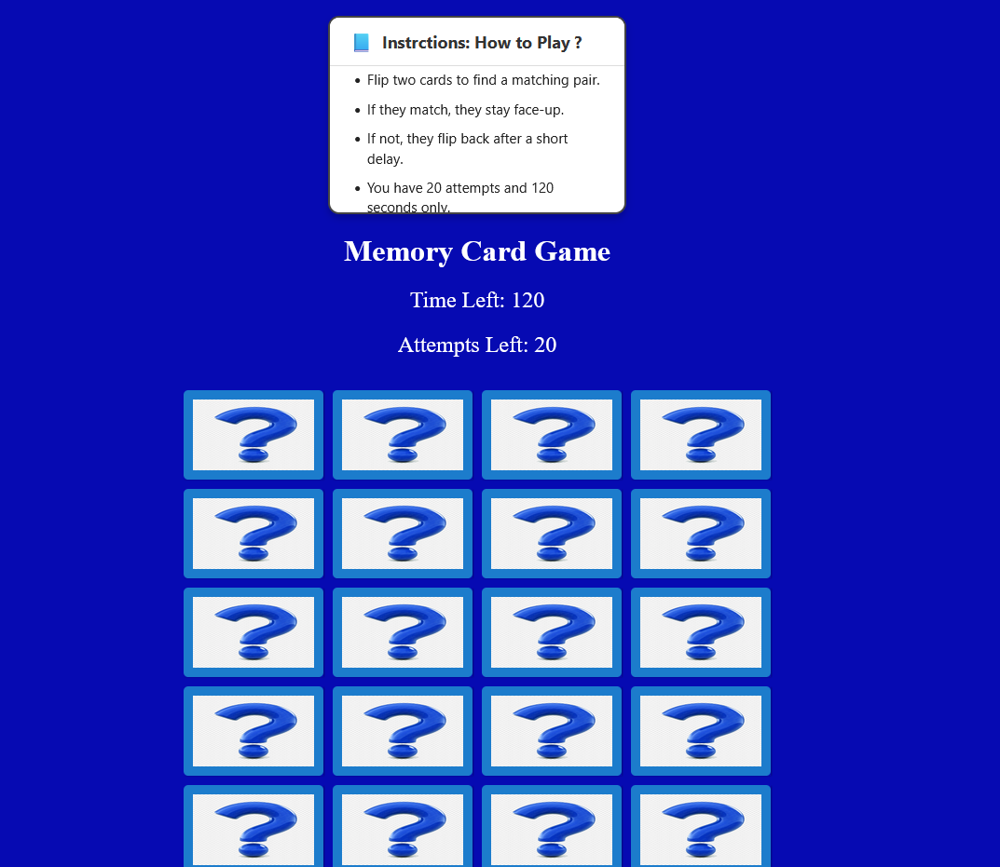
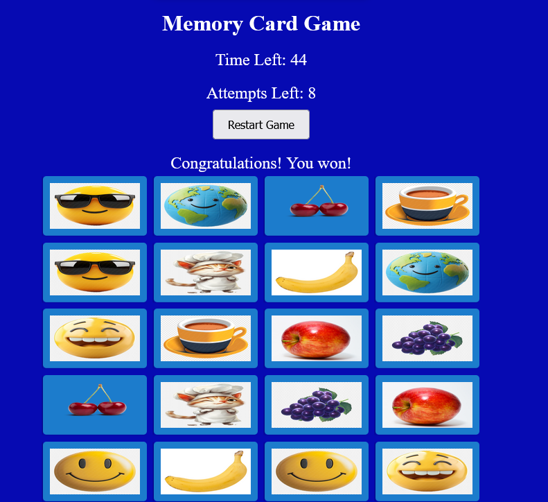
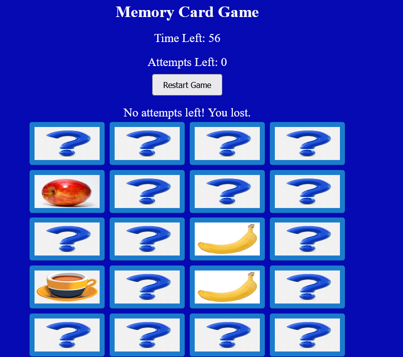
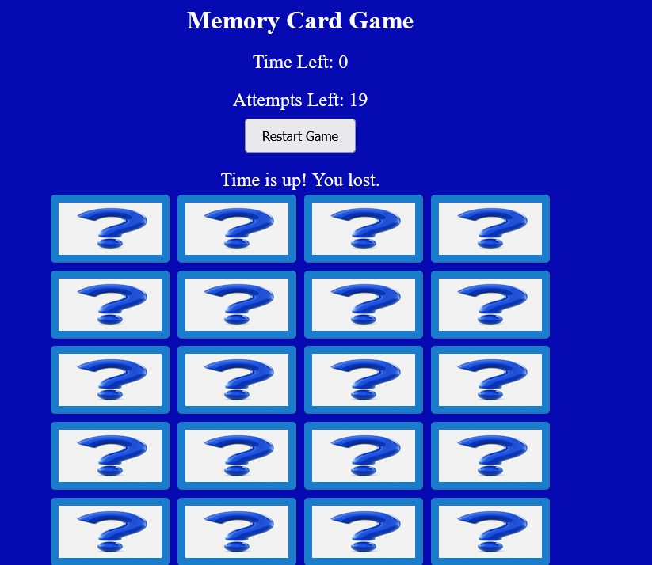

# Memory Card Game

## Screenshots :

### Game Interface

### Wining Message :

### Lose Message :
**No Attempts** 
**Time Is Up** 

## Description

**Memory Card Game** is a fun and interactive game that challenges your memory skills. The player is presented with a flexbox of face-down cards, and the objective is to match all the pairs before the time or attempts run out. I chose to create this game because it's a classic game that many enjoy and it's a great way to practice DOM manipulation, event handling, and working with timers in JavaScript.

The game includes:
- A countdown timer (120 seconds)
- A limited number of attempts (20 tries)
- A restart button that appears upon winning or losing
- Fun and colorful card images

## Getting Started

### Play the Game:
[Deployed Game Link](https://hasanjuma.github.io/Memory-card-game-project/)

## Technologies Used
- HTML
- CSS
- JavaScript 
- IMAGES

## Attributions

Images used for the cards were sourced from:
- [CleanPNG](https://www.cleanpng.com)
- [UploadImage](https://www.0zz0.com)
- [Wikimedia Commons](https://commons.wikimedia.org)

## Next Steps

Some planned improvements and features for the future:
- Add difficulty levels (easy, medium, hard)
- Add shake effects for matching/wrong cards
- Mobile responsiveness for smaller screens
- Add a light/dark mode

# User Stories

- As a **user**, I want to **flip two cards at a time** so that **I can try to find a matching pair**.

- As a **user**, I want to **see a timer counting down** so that **I know how much time I have left to finish the game**.

- As a **user**, I want to **have a limited number of attempts** so that **the game feels more challenging and exciting**.

- As a **user**, I want to **see a message when I win or lose** so that **I can know the outcome of the game clearly**.

- As a **user**, I want to **restart the game** after losing or winning so that **I can try again and improve my score**.

- As a **user**, I want to **see the game cards shuffled every time** so that **each game feels different and not predictable**.

- As a **user**, I want the **cards to flip with a nice animation** so that **the game feels smooth and fun to interact with**.

- As a **user**, I want the **visuals to be colorful and clear** so that **I can easily recognize and match the images**.

# Memory Card Game

A classic memory matching game built using HTML, CSS, and JavaScript.  
Players must match pairs of cards within a time and attempt limit.

---

## 🎮 How to Play

- Click any card to start the game and begin the timer.
- Flip two cards to try and find a matching pair.
- If the cards match, they remain face-up.
- If the cards don't match, they flip back after a short delay.
- You have 20 attempts and 120 seconds to match all cards.
- The game ends when:
  - You match all pairs (you win).
  - Time runs out or attempts reach zero (you lose).
- Click the Restart button to play again.

---

## 🧠 Game Logic (Pseudocode)

### Game Initialization
- On page load:
  - Select memory cards and UI elements (timer, attempts, message, restart).
  - Shuffle cards randomly.
  - Display attempts and time remaining.
  - Add click events to all cards.
  - Set attempts to 20 and time to 120 seconds.

### Starting the Game
- When the user flips the first card:
  - If the timer isn’t running, start countdown.

### Flipping Cards
- On card click:
  - Ignore click if board is locked or card is already flipped.
  - Flip card to reveal its face.
  - If it’s the first card:
    - Store as firstCard.
  - If it’s the second card:
    - Store as secondCard.
    - Lock the board.
    - Check if the two cards match.

### Matching Logic
- If cards match:
  - Disable further clicks on those cards.
  - Increment matched card count.
  - If all cards are matched:
    - Stop timer.
    - Show win message and restart button.
- If cards do not match:
  - Reduce attempts by 1.
  - If attempts reach 0:
    - Stop timer.
    - Show lose message and restart button.
  - Else:
    - Wait 1.5 seconds.
    - Flip cards back down.
    - Unlock the board.

### Timer Logic
- Every second:
  - Decrement time.
  - If time reaches 0:
    - Stop game.
    - Lock board.
    - Show time-up message and restart button.

### Restarting the Game
- On clicking Restart:
  - Reset attempts, time, and matched cards.
  - Clear messages.
  - Flip all cards face down.
  - Reattach event listeners.
  - Shuffle cards.
